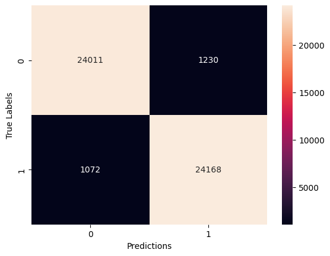
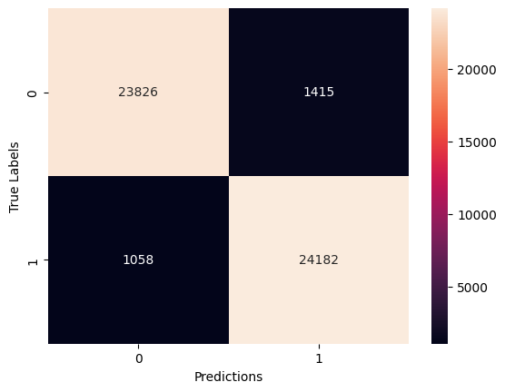

# LifeThread: Suicide Risk Assessment Using Social Media Posts

## Introduction

LifeThread is a project dedicated to assessing suicide risk based on textual data extracted from social media posts. The goal of this project is to leverage advanced machine learning techniques to identify posts that may indicate high risk of suicide. By analyzing posts from platforms such as Reddit and Suicide Watch, we aim to develop models that can effectively classify the level of risk and provide valuable insights for preventive measures.

The project employs a combination of sentiment analysis and classification models to evaluate the content of the posts. Initially, sentiment analysis was performed to gauge the overall mood of the posts. However, to enhance the precision of risk assessment, the focus shifted towards training classification models that use a variety of features to better predict suicide risk. It uses traditional machine learning models, and advanced language models like BERT and DistilBERT.

Explore this file to learn more about how data was processed, models were trained, and the results achieved in the context of suicide risk assessment.

# Table of Contents
1. Project Overview
2. Dataset
3. Sentiment Analysis
4. Transition from Sentiment Analysis to Classification Models
5. Life Thread Classifiers
6. ML Models
7. Language Models
8. Results
9. Conclusion

## Project Overview

The LifeThread project is focused on building a robust system for evaluating the risk of suicide based on text data from social media posts. This project employs a comprehensive approach, starting with traditional machine learning models and moving towards state-of-the-art language models to better capture nuances in language.

## Datasets

The project utilizes two datasets related to social media posts concerning depression and suicide.

### Dataset: Reddit Depression and SuicideWatch

**Source:** Kaggle - _Reddit Dataset: Depression and SuicideWatch_

**Description:** This dataset contains posts from Reddit classified as related to depression or suicidal thoughts. These data are used to assess suicide risk based on post content.

### Dataset: Suicide Watch

**Source:** Kaggle - _Suicide Watch Dataset_

**Description:** This dataset includes posts from the Suicide Watch forum, classified for suicide risk. Posts are used to train models evaluating risk based on text.

### Loading and Merging 

After downloading, both datasets were loaded and merged. Label classification was standardized using label mapping, where:

*  _depression_ and _non-suicide_ are labeled as **0 (low risk of suicide)**
*  _SuicideWatch_ and _suicide_ are labeled as **1 (high risk of suicide)**

### Text Processing

1.  **Normalization:** The text was converted to lowercase.
2.  **Duplicate Removal:** Duplicate posts were removed.
3.  **Sentiment Analysis:** Sentiment for each post was assessed using the DistilBERT model, and results were normalized to a uniform distribution using QuantileTransformer.
4.  **Preparations for Training:** Abandonment of sentiment analysis and preparations for classification models training.
5.  **Splitting into Training and Test Sets:** Data was divided into training and test sets for further model training and evaluation.

### Files and Folders

**combined_data.csv:** Combined dataset with labels and processed text.

**combined_data_with_risk.csv:** Dataset with additional sentiment analysis results.
Models/: Folder containing saved models

## Sentiment Analysis

### Description

Sentiment analysis is a crucial step in assessing the risk of suicide based on post content. In this project, sentiment analysis was performed using a transformer-based language model, specifically distilbert-base-uncased-finetuned-sst-2-english. This model was trained on the SST-2 (Stanford Sentiment Treebank) dataset, which is widely used for sentiment analysis tasks.

### Process

Model and Tokenizer Retrieval: Initially, the pre-trained model and tokenizer were loaded from the transformers library. The distilbert-base-uncased-finetuned-sst-2-english model was chosen for its ability to evaluate sentiment on a scale from 0 to 1, corresponding to a range from negative to positive sentiment.

**Text Tokenization:** Each post was tokenized using the BERT tokenizer, meaning the text was divided into tokens that the model could understand. Tokenization ensures that all texts have a uniform length and format, which is critical for the model's proper functioning.

**Sentiment Analysis:** The model analyzed the texts and assigned sentiment values on a scale from 0 to 1. These values represent the degree to which the text is positive. The results were then processed to derive overall conclusions about trends in the data.

**Normalization:** To make sentiment values more consistent and better suited for further analysis, a QuantileTransformer was applied, transforming the sentiment values to a uniform distribution scale.

### Analysis Results

#### Sentiment Distribution Histogram

Visualization of the sentiment value distribution revealed that posts classified as suicidal tend to have lower sentiment values compared to non-suicidal posts. Histograms provided a visual representation of these differences.


#### Conclusions

Non-suicidal posts (blue) have a higher concentration in the lower sentiment range (0-0.5), implying safer sentiment.
Suicidal posts (orange) cluster around the higher sentiment values (0.5-1), indicating more risky or harmful sentiment.

Sentiment analysis revealed that while the model effectively identifies certain trends and differences in sentiment between posts, sentiment alone is not always sufficient for precise suicide risk classification. Therefore, sentiment analysis was used as one component in a broader risk assessment context rather than as the sole classification tool.

### Role in the Project

Sentiment analysis provides valuable insights into the mood expressed in posts, which can help identify potentially risky content. However, due to the limitations of sentiment analysis alone, these results are used in conjunction with other classification methods to ensure a more accurate risk assessment.


## Transition from Sentiment Analysis to Classification Models

After performing sentiment analysis, it was determined that while sentiment values provided useful insights into the mood of the posts, they were not sufficient on their own for accurate suicide risk classification. Consequently, the focus shifted to developing and training classification models to better assess the risk based on the processed data.

### Rationale for Transition

- **Limitations of Sentiment Analysis**: Sentiment analysis revealed that while it could identify trends and general sentiment levels, it lacked the precision needed for reliable risk classification. Sentiment values alone did not fully capture the complexities of the posts related to suicide risk.

- **Need for More Robust Models**: To address the limitations, the decision was made to use more sophisticated classification models. These models could leverage additional features and patterns in the data beyond sentiment scores to improve accuracy and reliability.

### Outcome

By moving from sentiment analysis to specialized classification models, the project aimed to achieve a more nuanced understanding of the data and improve the accuracy of suicide risk assessments. The new models incorporated multiple features and advanced techniques, leading to better performance in distinguishing between high and low-risk posts.

## Life Thread Classifiers

**Data Preparation**: The data used for sentiment analysis was dropped to train a text-based classification model.

**Model Selection**: Various classification models were selected and trained, including:
1. **Simple ML Algotythms:**
  1.1. **Stochastic Gradient Descent (SGD)**
  1.2. **Naive Bayes**
  1.3. **Support Vector Classification (SVC)**
2. **Pre-trained Language Models:**
  2.1. **BERT**
  2.2. **DistilBERT**

## ML Models

Three traditional machine learning models were trained on the preprocessed dataset. These models served as a baseline for comparison against the more advanced language models.

* **Logistic Regression**: Simple, yet effective for binary classification tasks.
* **Support Vector Machine (SVM)**: Known for its effectiveness in high-dimensional spaces.
* **Random Forest**: An ensemble model that creates multiple decision trees and averages their predictions.

Each of these models was evaluated based on precision, recall, and F1 score to ensure robust performance.

### Stochastic Gradient Descent 

Achieved a solid accuracy of **0.8932** with the best hyperparameters:

```
(loss='log_loss', alpha=0.0001, max_iter=1000, penalty='l2')
```

Trained on 100% of dataset.

### Naive Bayes Classifier

Also showed strong performance with an accuracy of **0.8739**

Trained on 100% of dataset.

### Support Vector Classifier (SVC)

SVC model achieved the highest accuracy at **0.9004**, with the best parameters:

```
(C=100, gamma='scale', kernel='rbf')
```

Trained on 5% of dataset.

## Language Models

Two language models, BERT and DistilBERT, were fine-tuned for the classification of suicide risk:

BERT: A powerful language model trained on a massive corpus. It uses a custom tokenizer and was fine-tuned specifically for this project to assess risk levels.

DistilBERT: DistilBERT is a lighter version of BERT, optimized for speed while still retaining strong performance. It uses a different tokenizer than BERT and was also fine-tuned to predict risk levels based on text data.

### DistilBERT vs BERT - 20% of dataset

### Accuracy and loss comparision
| Metrics       | BERT 20%      | DistilBERT 20% |
| ------------- | ------------- | -------------- |
| Accuracy      | 0.9544        | 0.9510         |
| Loss          | 0.1629        | 0.1384         |

### Confusion Matrix

#### BERT trained on 20% of dataset



#### DistilBERT trained on 20% of dataset



## Results

After training and evaluation, the following observations were made:

Sentiment Analysis: DistilBERT's sentiment analysis proved effective in capturing emotional cues, which is crucial for understanding the overall tone of the posts.

Traditional ML Models: Logistic Regression, SVM, and Random Forest provided solid baselines, with Random Forest slightly outperforming the others in terms of recall.

Language Models: BERT and DistilBERT outperformed traditional models in capturing complex linguistic patterns. BERT, with its larger architecture, performed best in terms of overall accuracy and F1 score.

## Conclusion

LifeThread demonstrates the value of combining traditional machine learning techniques with cutting-edge language models to assess suicide risk. While traditional models offer quick and interpretable results, advanced models like BERT and DistilBERT can provide deeper insights, especially when dealing with complex text data.
